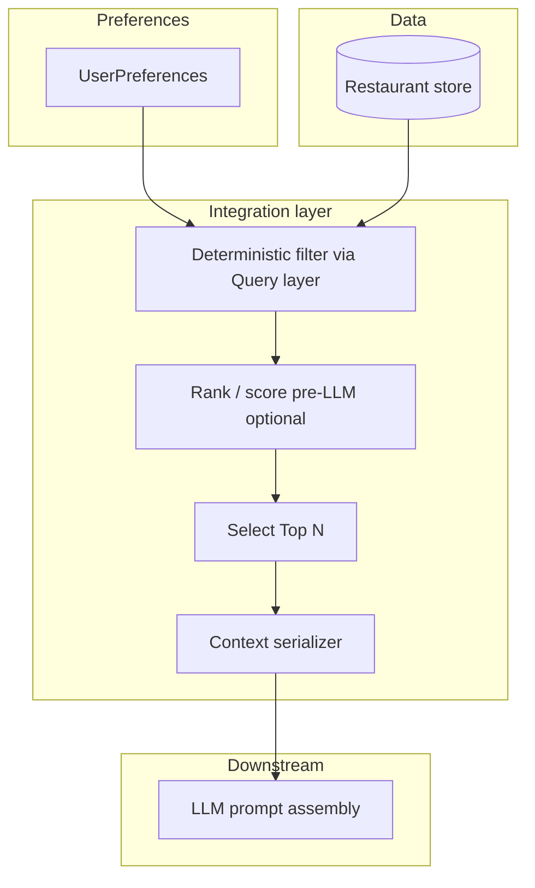

# Phase-Wise Architecture: AI-Powered Restaurant Recommendation System

**Version:** 1.2 (detailed)  
**Related:** [`problemStatement.md`](../phase0/problemStatement.md)  
**Dataset:** [ManikaSaini/zomato-restaurant-recommendation](https://huggingface.co/datasets/ManikaSaini/zomato-restaurant-recommendation) (Hugging Face)

This document expands the end-to-end workflow from the problem statement—**data ingestion → user input → integration → LLM ranking → output display**—into implementable phases with components, contracts, diagrams, and operational concerns.

---

## Table of contents

1. [System context](#1-system-context)
2. [High-level data flow](#2-high-level-data-flow)
3. [Phase 0 — Scope, constraints, success criteria](#phase-0--scope-constraints-success-criteria)
4. [Phase 1 — Data foundation](#phase-1--data-foundation-ingestion--preprocessing)
5. [Phase 2 — Storage and query layer](#phase-2--storage--query-layer)
6. [Phase 3 — User input and preference model](#phase-3--user-input--preference-model)
7. [Phase 4 — Integration layer](#phase-4--integration-layer-filter--llm-context)
8. [Phase 5 — Recommendation engine (LLM)](#phase-5--recommendation-engine-llm)
9. [Phase 6 — Application and presentation](#phase-6--application--presentation-layer)
10. [Phase 7 — Hardening and operations](#phase-7--hardening--operations)
11. [Cross-cutting concerns](#cross-cutting-concerns)
12. [Suggested repository layout](#suggested-repository-layout)
13. [Risk register](#risk-register)
14. [Build order and milestones](#build-order-and-milestones)

---

## 1. System context

The system is a **hybrid recommender**: structured retrieval (filters over a real dataset) plus **LLM-assisted ranking and natural-language explanations**. The LLM must not invent venues; it only reasons over candidates supplied by the application.

**Primary actors**

| Actor | Role |
|--------|------|
| End user | Submits preferences and reads ranked results with explanations. |
| Application service | Validates input, queries data, builds prompts, calls LLM, validates output. |
| Data store | Holds preprocessed restaurant records (read-heavy). |
| LLM provider (**Groq**) | Returns ranked rationale and text via Groq’s API; stateless per request. |

**Quality bar (typical)**

- Recommendations are drawn from the dataset (or explicitly flagged when none match).
- Explanations cite concrete attributes (cuisine, rating, cost, location) where possible.
- p95 latency acceptable for demo (for example under 5–10 seconds including LLM) unless you optimize with caching/streaming.

---

## 2. High-level data flow

```mermaid
sequenceDiagram
  participant U as User / Client
  participant API as Application API
  participant Q as Query layer
  participant DS as Data store
  participant INT as Integration
  participant LLM as LLM service

  U->>API: Preferences (JSON or form)
  API->>API: Validate & normalize
  API->>Q: filter(prefs)
  Q->>DS: Indexed read / SQL / scan
  DS-->>Q: Raw matching rows
  Q-->>API: Candidate set (0..M)
  API->>INT: select_top_n + build_context
  INT-->>API: Prompt payload (structured)
  API->>LLM: Chat/completions + schema instructions
  LLM-->>API: Ranked IDs/names + explanations
  API->>API: Validate against candidates; fallback if needed
  API-->>U: Top K + fields + explanations (+ optional summary)
```

---

## Phase 0 — Scope, constraints, success criteria

### Objectives

- Freeze **vocabulary** that the UI, API, and filters share (locations, cuisines, budget bands).
- **LLM stack (locked):** **Groq** for chat/completions (fast hosted inference). Authentication via **API key in `.env`** (see Phase 3); **hosting** of the app remains local or your choice of cloud for the API/UI only.
- Define **non-goals** (e.g. real-time Zomato sync, payments, maps routing) to avoid scope creep.

### Decisions to document

| Topic | Options | Notes |
|--------|---------|--------|
| Budget mapping | Fixed enums vs. percentile-based from dataset | Enums simplify UX; percentiles track data drift. |
| Location granularity | City vs. neighborhood | Must match how the dataset encodes place. |
| “Additional preferences” | Free text only vs. text + optional tags | Tags improve filterability; text alone needs LLM or search. |
| Top-K to user vs. Top-N to LLM | e.g. K=5, N=20–30 | N controls cost; K is product choice. |
| LLM vendor | **Groq** (chosen) | OpenAI-compatible HTTP API; key from `.env`, not source control. |

### Deliverables

- One-page **requirements** + **non-goals**.
- **Evaluation rubric**: relevance (manual spot checks), hallucination rate (names not in candidate list), latency, cost per request.
- **Definition of Done** for MVP: single city or full dataset, one UI path, one recommend endpoint.

---

## Phase 1 — Data foundation (ingestion & preprocessing)

### Objectives

Produce a **stable, documented schema** of restaurants aligned with the Hugging Face dataset, cleaned enough for reliable filtering and display.

### Ingestion pipeline (logical steps)

1. **Acquire:** Pin dataset revision (`datasets` library or scripted download) for reproducibility.
2. **Explore:** Profile columns, null rates, value distributions (cities, cuisines, price fields).
3. **Normalize:**
   - **Identifiers:** Stable `restaurant_id` (hash or row index only if immutable after load).
   - **Names:** Trim, collapse whitespace, optional deduplication key `(name_normalized, city)`.
   - **Location:** Map raw fields to `city`, optional `area`/`locality` if present.
   - **Cuisine:** Split multi-label strings (e.g. “Chinese, Thai”) into arrays; lowercase; synonym map (“Fast Food” vs “fast food”).
   - **Cost:** Map numeric or categorical source fields to `cost_band` ∈ {low, medium, high} using explicit rules documented in code.
   - **Rating:** Parse to float; treat missing as null or impute with policy (document if imputed).
4. **Enrich (optional):** Derive boolean flags from text columns if the dataset supports it (e.g. keywords for “family-friendly”).
5. **Persist:** Write **Parquet** or **SQLite/Postgres** for querying; keep a raw snapshot for audit.

### Target schema (illustrative)

| Field | Type | Purpose |
|--------|------|---------|
| `restaurant_id` | string | Stable key for LLM output validation and UI. |
| `name` | string | Display and matching. |
| `city` | string | Primary location filter. |
| `area` | string? | Finer filter if available. |
| `cuisines` | string[] | Multi-select filter and prompt context. |
| `cost_band` | enum | Budget filter. |
| `rating` | float? | Min-rating filter and ranking tie-break. |
| `approx_cost_for_two` | numeric? | Display if dataset provides; else omit. |
| `raw_notes` | string? | Optional; for future semantic search. |

### Testing and quality gates

- **Row count** and **column coverage** assertions after each pipeline run.
- **Golden file** or snapshot tests: known input rows → expected normalized output for tricky cases (multi-cuisine, missing rating).

### Deliverables

- `phase1_ingestion/scripts/ingest.py` (or equivalent) + **data dictionary** (`docs/data_dictionary.md` or JSON schema).
- Cleaned artifact path configurable via environment variable.

---

## Phase 2 — Storage & query layer

### Objectives

Expose **fast, deterministic** filtering used by every recommendation request, independent of the LLM.

### Storage options

| Option | When to use |
|--------|----------------|
| **SQLite** | Simple MVP, single-node, easy to ship. |
| **Postgres** | Shared service, concurrent users, full-text search later. |
| **Parquet + DuckDB/polars** | Analytics-style queries in-process, no server. |

### Indexing strategy

- **B-tree or composite indexes** on `(city, cost_band)`, `(city, rating)` depending on query pattern.
- If cuisine is array-like: either **normalized junction table** `(restaurant_id, cuisine)` or **JSON/array** queries if the engine supports them efficiently.

### Query module contract (conceptual)

```text
filter_restaurants(
  city: string,
  cuisines?: string[],          # ANY or ALL — pick one and document
  min_rating?: float,
  cost_bands?: CostBand[],
  limit?: int                   # safety cap before Top-N selection
) -> list[RestaurantRow]
```

### Edge cases

- **Zero results:** Return empty list; upper layers suggest relaxing filters (Phase 6).
- **Ambiguous location:** Fuzzy match with explicit confidence threshold or strict match only (document choice).
- **Cuisine synonyms:** Normalize at query time using the same map as ingestion.

### Deliverables

- `query.py` / `repository` module with unit tests: empty set, single filter, combined filters, limit behavior.

---

## Phase 3 — User input & preference model

### Objectives

Turn UI or API payloads into a **validated, canonical preference object** used by the query and integration layers.

### Canonical preference model (illustrative JSON)

```json
{
  "location": "Delhi",
  "budget": "medium",
  "cuisines": ["Italian"],
  "min_rating": 4.0,
  "additional_preferences": "Family-friendly, quick service",
  "desired_top_k": 5
}
```

### Validation rules

- **Enums:** `budget` ∈ allowed set; `location` ∈ known cities or free text with warning.
- **Bounds:** `min_rating` in [0, 5] (or dataset max); `desired_top_k` capped (e.g. ≤ 10).
- **Free text:** Max length (e.g. 500 chars), strip control characters, optional basic profanity policy for demos.

### Mapping to query layer

- `location` → `city` (and optional `area` if you add it later).
- `budget` → `cost_bands` list (e.g. medium only, or medium ± adjacent per product rule).
- `cuisines` → pass through after normalization.
- `min_rating` → `min_rating` filter.

### Groq LLM and `.env` (secrets)

Phase 3 is where the **API and preference contract** are defined; the same backend will call **Groq** for ranking and explanations in Phases 4–5. Configure the Groq client as follows:

- **Provider:** **Groq** (use their **OpenAI-compatible** chat/completions endpoint).
- **API key:** Store the Groq API key in a **`.env`** file in the project root (e.g. `GROQ_API_KEY=...`). Load it at runtime with **`python-dotenv`** or your framework’s env loader. **Never commit `.env`**; add it to `.gitignore`.
- **`.env.example`:** Commit a template listing **`GROQ_API_KEY`** (empty or placeholder) and optional **`GROQ_MODEL`** / base URL, with no real secrets.
- Optional: document **`GROQ_MODEL`** (e.g. a specific Groq-hosted model id) next to the key for reproducibility.

### Deliverables

- Shared models (e.g. **Pydantic** `UserPreferences`) + OpenAPI schema if using FastAPI.
- Error payload shape: `field`, `message`, `code` for frontend display.
- **`.env.example`** including **`GROQ_API_KEY`** (and optional model vars) for local setup.

---

## Phase 4 — Integration layer (filter → LLM context)

### Objectives

Combine **user preferences** and **filtered rows** into a **compact, auditable context** for the LLM, with explicit **Top-N** selection to control tokens and cost.

### Internal flow



### Pre-LLM ranking (optional but useful)

Before calling the model, sort candidates by a simple score, e.g.:

- Primary: `rating` descending (nulls last).
- Secondary: closeness of `cost_band` to user `budget`.
- Tertiary: name stable sort for determinism.

This makes the LLM’s job easier and improves fallback quality if the LLM fails.

### Context serialization

- Prefer **JSON** or **markdown table** with fixed columns: `id`, `name`, `cuisines`, `rating`, `cost_band`, `city`.
- Include a short **“user ask”** block: restated preferences + `additional_preferences` verbatim (bounded length).

### Observability hooks

- Log: `candidates_before_limit`, `candidates_after_filter`, `n_sent_to_llm`, `pref_hash` (no PII), `request_id`.

### Deliverables

- `build_llm_context(prefs, candidates) -> { system_hints, user_content, candidate_ids }`
- Unit tests: N truncation, stable ordering, empty candidates.

### Implementation in this repository

| Component | Location |
|-----------|----------|
| Pre-LLM sort + context builder | `src/zomato_recommend/context.py` (`sort_candidates_pre_llm`, `build_llm_context`, optional family hint from free text) |
| Preference model (Phase 3) | `src/zomato_recommend/models.py` (`UserPreferences`, `budget_to_cost_bands`) |
| End-to-end service (query → context → LLM) | `src/zomato_recommend/service.py` |
| Automated tests (3 cases) | `phase4_integration/tests/test_phase4_backend.py` — empty context, Top-N truncation/sort, `POST /api/v1/recommend` with mocked pipeline |

Environment: `MAX_CANDIDATES_LLM` (default 25), `QUERY_CANDIDATE_LIMIT` (default 200). Response `debug` includes `candidates_after_filter` and `n_sent_to_llm`.

---

## Phase 5 — Recommendation engine (LLM)

### Objectives

Use **Groq** (via its **OpenAI-compatible API**) to **rank** a subset of candidates and produce **human-like explanations**, optionally a **short summary**, while **grounding** outputs in the supplied list. The **Groq API key** is read from **`.env`** (see Phase 3); the application must not embed secrets in code.

### Prompting strategy

1. **System message:** Role (expert local dining assistant), **hard constraint**: “You may only recommend restaurants from the provided numbered/ID list. Do not invent venues.”
2. **User/developer content:** User preferences + serialized candidate list + **output format instructions**.

### Structured output (recommended)

Ask for **JSON** matching a schema, for example:

```json
{
  "summary": "Optional one paragraph overview.",
  "recommendations": [
    {
      "restaurant_id": "…",
      "rank": 1,
      "explanation": "2–4 sentences tying to cuisine, rating, budget, location."
    }
  ]
}
```

Use **JSON mode** / **response_format** where the provider supports it; otherwise include a strict example and parse defensively.

### Post-processing and safety checks

- **Allow-list validation:** Every `restaurant_id` (or normalized name) must exist in the candidate set; drop or reorder invalid entries.
- **Fallback:** If parsing fails or validation yields fewer than K items, fill from pre-LLM sorted list with **templated** explanations (“High rating and matches your cuisine filter”) to avoid blocking the UI.
- **Temperature:** Lower (e.g. 0.2–0.5) for more consistent JSON and less hallucination.

### Cost and latency controls

- Cap **N** (candidates in prompt); cap **max_tokens**; reuse static system prompt where possible.
- Optional **caching** keyed by `(prefs_hash, dataset_version)` for repeat queries in demos.

### Deliverables

- `prompts/system.md`, `prompts/user_template.md` (or strings in code with version constant).
- `llm_client` wrapper targeting **Groq** (base URL and auth header per Groq docs), with retries, timeouts, error typing.
- Tests with **mocked LLM** responses: valid JSON, malformed JSON, hallucinated id.

### Implementation in this repository

| Component | Location |
|-----------|----------|
| Groq chat + JSON parse + allow-list + fallback | `src/zomato_recommend/llm_rank.py` (`groq_rank_and_explain`) |
| Live Groq smoke tests | `phase5_llm/tests/test_groq_connection.py` |

---

## Phase 6 — Application & presentation layer

### Objectives

Deliver a **single coherent product path**: user enters preferences → sees **top recommendations** with **name, cuisine, rating, estimated cost, AI explanation** (per problem statement).

### Backend API (REST sketch)

| Method | Path | Description |
|--------|------|-------------|
| POST | `/api/v1/recommend` | Body: `UserPreferences`; returns ranked results. |
| GET | `/api/v1/meta/locations` | Optional: populate dropdown from dataset. |
| GET | `/health` | Liveness for deployment. |

**Response shape (illustrative)**

```json
{
  "request_id": "uuid",
  "results": [
    {
      "restaurant_id": "…",
      "name": "…",
      "cuisines": ["Italian"],
      "rating": 4.3,
      "estimated_cost_label": "medium",
      "explanation": "…"
    }
  ],
  "warnings": ["No exact cuisine match; showing nearby options."]
}
```

### Frontend UX requirements

- **Loading:** Disable submit, show spinner/skeleton during LLM call.
- **Empty state:** Explain which filters likely caused zero matches; suggest actions.
- **Partial failure:** If LLM fails but data exists, show deterministic list + message.
- **Accessibility:** Labels for form controls, sufficient contrast, keyboard submit.

### Stack options (choose one for MVP)

- **Streamlit / Gradio:** Fastest path for demos.
- **FastAPI + React/Vite:** Clear separation, closer to production patterns.

### Deliverables

- Runnable app, `.env.example`, README run instructions.

### Implementation in this repository

| Component | Location |
|-----------|----------|
| FastAPI app | `src/zomato_recommend/app.py` — `GET /health`, `GET /` (demo UI), `POST /api/v1/recommend` |
| Static demo UI | `phase4_integration/static/index.html` — form → JSON API; dark theme; shows summary, warnings, cards (name, cuisines, rating, cost, explanation) |
| Run server | From repo root: **`python run_dev.py`** (sets `src` on `sys.path`; keep the terminal open). Default **http://127.0.0.1:8765** — port **8765** avoids Windows blocking **8000** (WinError 10013). Override with `PORT` / `HOST` in `.env`. Or `.\run_server.ps1`. |
| Secrets template | `.env.example` (`GROQ_API_KEY`, optional `GROQ_MODEL`) |

CORS allows `localhost:8765` and `localhost:8000` by default for same-origin UI. The UI is intentionally minimal for manual testing of Phase 4–5 behavior.

---

## Phase 7 — Hardening & operations

### Security and abuse

- **Secrets:** **Groq API key** only via **`.env`** (or deployment env vars); never commit `.env` or real keys.
- **Prompt injection:** Treat `additional_preferences` as untrusted; instruct model to ignore instructions that contradict grounding rules; keep role boundaries in system prompt.
- **Rate limiting:** Per IP or per API key if exposed publicly.

### Observability

- Structured logs: `request_id`, timings (`filter_ms`, `llm_ms`), `n_candidates`, outcome (`success`, `fallback`, `error`).
- Optional: export metrics (Prometheus) if you deploy long-running.

### Configuration management

| Variable | Purpose |
|----------|---------|
| `DATA_PATH` | Path to SQLite file or connection string. |
| `DATASET_VERSION` / `BUILD_ID` | Traceability in responses or logs. |
| `GROQ_API_KEY` | Groq API key (set in **`.env`** locally; use platform secrets in production). |
| `GROQ_MODEL` (optional) | Model id for chat completions on Groq. |
| `GROQ_BASE_URL` (optional) | Override only if Groq’s default OpenAI-compatible base URL changes or for testing. |
| `MAX_CANDIDATES_LLM`, `TOP_K_DEFAULT` | Tunable limits. |

### CI (recommended)

- Lint + unit tests on PR; optional **smoke test** with LLM disabled (mock).

### Deliverables

- Documented env vars, health check, minimal runbook for “LLM quota exceeded.”

---

## Cross-cutting concerns

| Concern | How it appears across phases |
|---------|------------------------------|
| **Reproducibility** | Pinned dataset revision, versioned preprocess, logged `DATASET_VERSION`. |
| **Grounding** | Candidate allow-list in Phase 4–5; validation after LLM. |
| **Testing** | Heavy unit tests on filter and validation; mocked LLM; thin E2E. |
| **Internationalization** | Out of scope for MVP unless required; keep strings centralized if added later. |

---

## Suggested repository layout

```text
ProjectFolder/
  phase0/                 # problem statement + short architecture
  phase1_ingestion/       # ingest script + Phase 1 tests
  phase2_query/           # SQLite materialize + Phase 2 tests
  phase4_integration/     # Phase 4 tests + static demo UI
    static/index.html
    tests/
  phase5_llm/             # Groq connection tests
  docs/
    phase-wise-architecture.md
    data_dictionary.md
  data/
    raw/
    processed/            # parquet / sqlite output
  src/
    zomato_ingest/        # ingest + SQLite query
    zomato_recommend/     # prefs, Phase 4 context, Groq rank, FastAPI app
  requirements.txt
  pyproject.toml
  .env.example
```

(Adjust names to match your chosen language and framework.)

---

## Risk register

| Risk | Impact | Mitigation |
|------|--------|------------|
| Dataset columns differ from assumptions | Broken filters | Phase 1 profiling + schema tests |
| LLM invents restaurants | Trust failure | Strict ID allow-list + fallback ranking |
| High latency / cost | Poor UX / budget | Top-N cap, caching, smaller model for demo |
| Sparse matches for strict prefs | Empty results often | Warnings + “relax filter” suggestions + optional widen rules |
| Prompt injection via free text | Misbehavior / data leak in logs | Sanitize length, logging redaction, system prompt rules |

---

## Build order and milestones

| Milestone | Phases | Outcome |
|-----------|--------|---------|
| M1 | 0, 1 | Clean data artifact + documented schema |
| M2 | 2 | Query module with tests |
| M3 | 3, 4 | Validated prefs + context builder |
| M4 | 5 | LLM ranking with validation + fallback |
| M5 | 6 | Full user journey in UI |
| M6 | 7 | Config, logging, basic hardening |

Parallelization: after M2, **Phase 3** (models/API) and **Phase 4** (context builder) can proceed in parallel; **Phase 5** depends on stable context from Phase 4.

---

## Architecture summary

**Deterministic retrieval** over a versioned, preprocessed Zomato-derived dataset produces a **bounded candidate set**. The **integration layer** serializes candidates and preferences into a **grounded prompt**. The **LLM** ranks and explains within that set; the **application** **validates** outputs and **falls back** to deterministic ordering when needed. The **UI** presents structured fields plus explanations for a clear, trustworthy recommendation experience.
